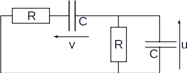

---
jupytext:
  text_representation:
    extension: .md
    format_name: myst
    format_version: 0.13
    jupytext_version: 1.10.3
kernelspec:
  display_name: Python 3
  language: python
  name: python3
---

# Système linéaire et ordre 2
Le but est de voir comment utiliser la méthode d'intégration d'Euler explicite pour étudier le régime transitoire d'un système d'équations. On a alors un système d'équations différentielles. 

## Position du problème
On s'intéresse au pont de Wien en régime libre :



> __Exercice :__
> 1. (Théorie)Montrer par le calcul que ce circuit est régit par le système d'équation suivant :
>

$$
\begin{cases}
\frac{\rm{d}u}{\rm{dt}} = - \frac{1}{RC} v - \frac{2}{RC}u\\
\frac{\rm{d}v}{\rm{dt}} = - \frac{1}{RC} v - \frac{1}{RC}u
\end{cases}
$$

## Vision vectorielle
Le système d'équations différentielles précédent peut être vu comme une seule équation différentielle faisant un intervenir des vecteurs:
>
$$ {\rm{d} \over \rm{d}t}
\begin{pmatrix}
u\\
v
\end{pmatrix}
=
\begin{pmatrix}
- {1 \over RC} v - {2 \over RC} u\\
- {1 \over RC} v - {1 \over RC} u
\end{pmatrix}
$$

soit, en définissant le vecteur:

$$ Y(t)=
\begin{pmatrix}
u(t)\\
v(t)
\end{pmatrix}
$$

Sa dérivée est:

\begin{equation}
{\rm{d}Y \over \rm{d}t} = F(t, Y(t))
\end{equation}

avec :

$$ F(t, Y(t)) = 
\begin{pmatrix}
- {1 \over RC} v(t) - {2 \over RC} u(t)\\
- {1 \over RC} v(t) - {1 \over RC} u(t)
\end{pmatrix}
$$

_On rappelle que d'un point de vue vectoriel:_

* `u = Y[0]` et `v = Y[1]`.
* `F` prend comme argument un vecteur `Y` (de taille 2) et renvoie un vecteur de taille 2.
* On n'a techniquement pas besoin du temps puisque `F` ne dépend pas explicitement du temps mais on prendra l'habitude de le mettre comme argument même si on ne l'utilise pas (pour des fonctions comme `solve_ivp`).

## Schéma d'Euler
Le principe du schéma d'Euler est alors identique au cas d'ordre 1 avec une seule fonction:

$$
Y_{k+1} \approx Y_k + F(t_k, Y_k) \times h
$$
avec $Y_{k} = Y(t_k)$ et $h = t_{k+1} - t_k$

```{sidebar} Tableau numpy
A la fin de la boucle, il est toujours conseillé de transformer la liste de vecteurs en un vecteur de vecteur, c'est-à-dire un tableau numpy qui sera plus facilement manipulable.

Chaque vecteur constitue alors une ligne du tableau et chaque colonne correspond donc aux valeurs $u(t_k)$ et $v(t_k)$.
```
__Il faudra juste veiller à ce que la fonction $F$ renvoie un vecteur et que $Y$ soit un vecteur dans les programmes.__ Les valeurs calculées aux instant $t_k = t_0 + hk$ sont alors stockées dans une liste qui sera __une de vecteurs de taille 2__.

+++

